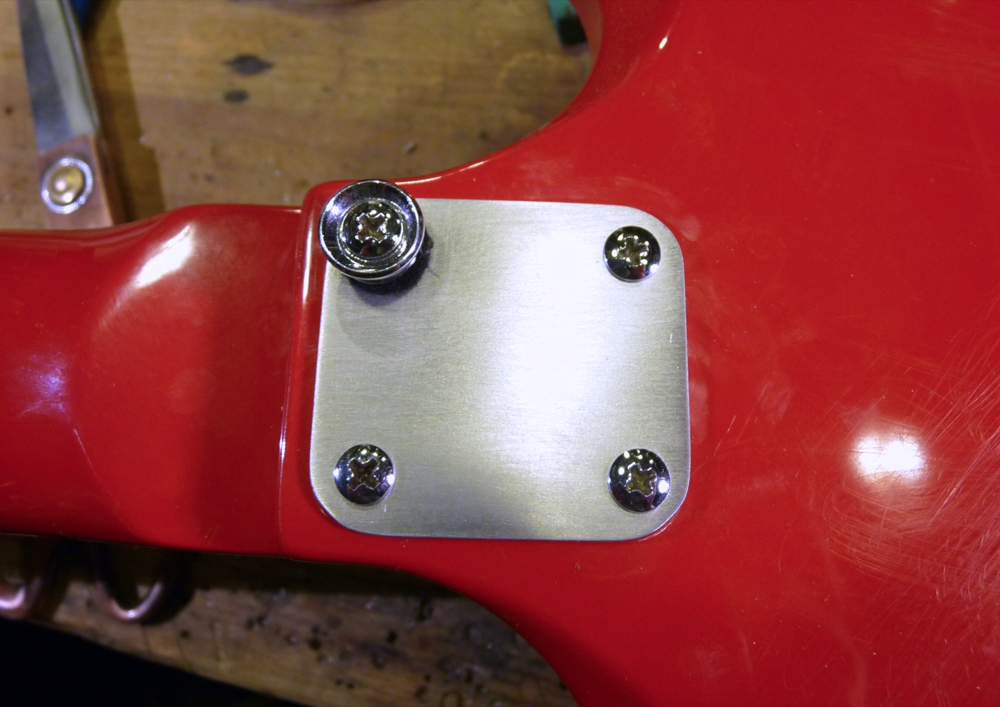
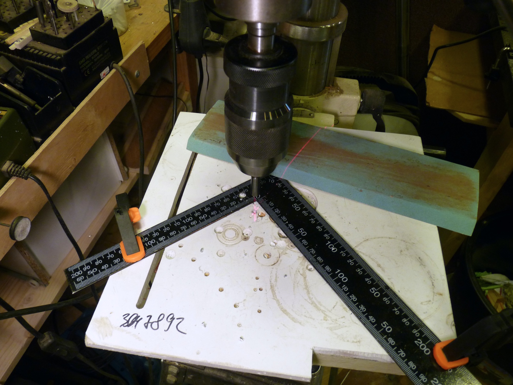
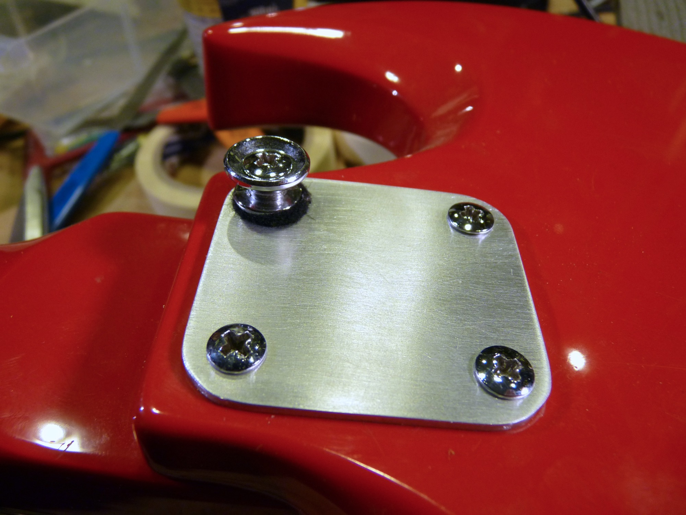

Полезно иногда навещать соседское ЧПУ-производство и собирать там обрезки заготовок. Им они уже ни к чему, а мне как раз. Алюминий - вполне себе металл, но с ним очень легко работать. А лишнего материала в цехах остается навалом.

Вот, скажем, принесли в мастерскую гитару, купленную за копейки, убитую полностью. Даже некплейта при ней не было. А некплейт на этой модели не фендеровский (прямоугольный), а мелкий и квадратный. Где такой искать? Как раз в куче обрезков. И потратить десять минут на изготовление.

Серьезно, десять. Последовательность процедур:

* Найти в куче хлама кусок алюминиевой пластины толщиной 2 мм;

* обрезать в размер на микроциркулярке;

* закруглить края на гриндере;

* просверлить четыре отверстия;

* раззенковать их;

* зашкурить пластину 180-й наждачкой для придания "brushed"-текстуры, не забыв завалить острые грани.

Единственная сложность тут может возникнуть с симметричным расположением отверстий. Эту задачу решает угольник. Все отверстия получатся на равном расстоянии от краев:

***

Не хром, конечно, но для фанерного эпифона с многочисленными сквозными дырами — сгодится.

Надо бы еще немножко утопить шляпки, сейчас займусь.


В ЧПУ-фрезеровке алюминий коварен: любит ко всему липнуть и ломать фрезы. Не используйте с ним "кукурузы" и используйте СОЖ, и все будет хорошо. Даже изопропиловый спирт отлично работает.

Зато на ленточке алюминий пилится прекрасно, было бы подходящее полотно. Скорости те же, что и для дерева.
