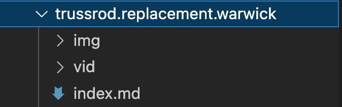
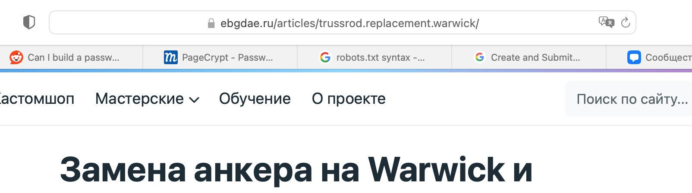
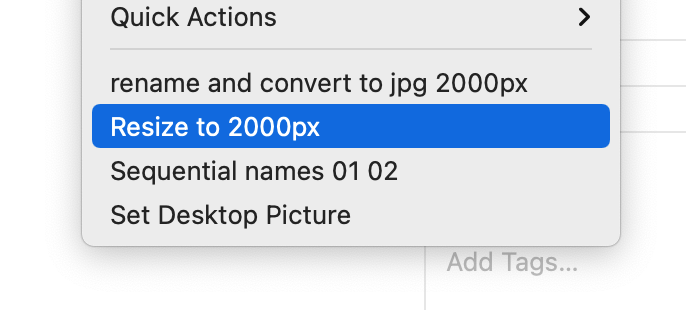
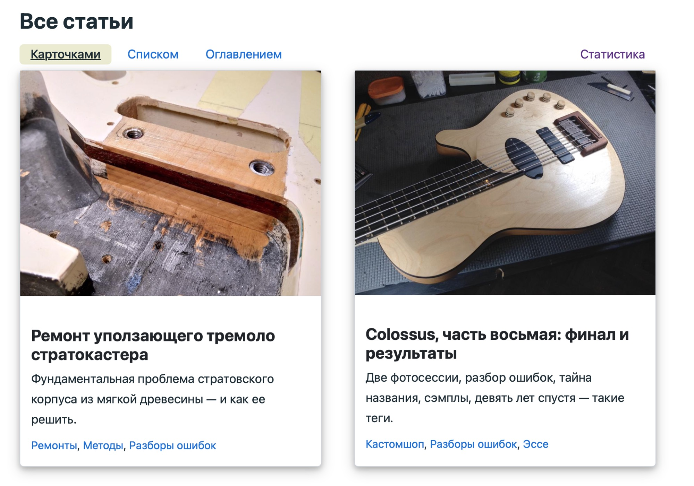
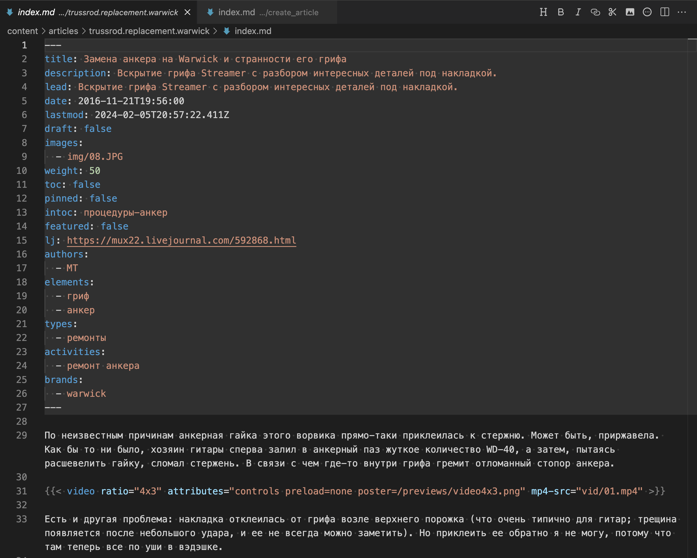
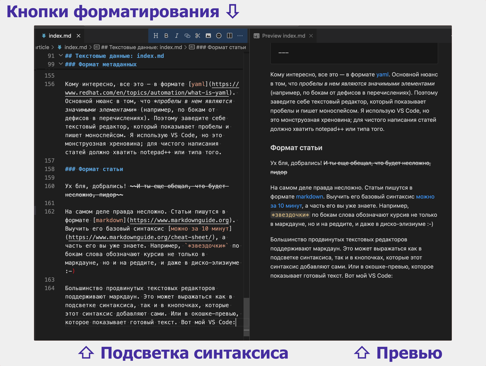
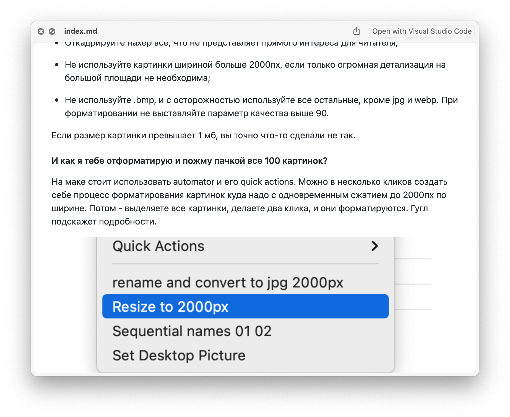

Оформление статьи для йибуя не сильно сложнее оформления для любой другой платформы, типа лонгридов вк, телеграфа или сабстэка. В данном тексте я покажу, как это сделать. 

В результате следования приведенным инструкциям у вас получится удобный page bundle, который можно не только отправить мне, но и использовать на других ресурсах в дальнейшем, или даже просто распространять для чтения как есть.

## Page bundle?..

"Бандл" переводится как "охапка". Пейдж-бандл — это папка со статьей, содержащая в себе и текст, и картинки, и все остальное, из чего состоит статья. **Но ничего более**: внешние элементы оформления, типа логотипа сайта, лежат в другом месте.

Вот как выглядит пейдж-бандл статьи "[Замена анкера на ворвике](/articles/trussrod.replacement.warwick/)":



Внутри папки лежит текстовый `index.md`, а также *ресурсы*, которые я для удобства распределяю по типу: папка с картинками `img`, папка с видео `vid`. Можно этого не делать и валить все в одну кучу, но тогда быстро начинается бардак.

Названия всех файлов и папок, **кроме `index.md`**, вы выбираете сами. Название самого бандла — 
`trussrod.replacement.warwick` — становится заключительной частью URL на сайте:


<p class = "bottomline" >внимание на адресную строку</p>

Я начну с правил, по которым используются ресурсы.

## Ресурсы статьи

### Требования к картинкам

Не более 2000пх по ширине, форматы jpg, jpeg, png, webp, gif. Есть нюансы.

Мой движок пожмет ваши картинки и переформатирует в webp, однако **оригиналы все равно окажутся на сайте** и будут доступны по клику на картинку (можете проверить по тем, которые в этой статье). Соответственно, для экономии места и ресурсов есть смысл делать картинки настолько мелкими, насколько возможно, и предоставлять их в наиболее экономичном формате.

**Что это значит практически:**

* Откадрируйте нахер все, что не представляет прямого интереса для читателя;

* Не используйте картинки шириной больше 2000пх, если только огромная детализация на большой площади не необходима;

* Не используйте .bmp, и с осторожностью используйте все остальные, кроме jpg и webp. При форматировании не выставляйте параметр качества выше 90. 

Если размер картинки превышает 1 мб, вы точно что-то сделали не так.

#### И как я тебе отформатирую и пожму пачкой все 100 картинок?

На маке стоит использовать automator и его quick actions. Можно в несколько кликов создать себе процесс форматирования картинок куда надо с одновременным сжатием до 2000пх по ширине. Потом - выделяете все картинки, делаете два клика, и они форматируются. Гугл подскажет подробности.



На виндах не знаю, но, скорее всего, любая продвинутая листалка типа ACDSee (если она живая еще :-) умеет экспортировать. Ну, или лайтрум. Я правда не знаю ничего, погуглите "пакетная обработка фоток".

#### Титульное изображение

Это картинка, которую показывают в превью на сайте и в некоторых других местах:



Она не обязательно присутствует в самой статье — можно использовать ее только для превью.

**Титульное изображение должно быть в пейзажной ориентации с пропорцией 4 на 3.** Это обязательное правило. Конкретный размер не важен, но меньше 800пх по ширине лучше не падать, чтобы превью не размылило.

Где указать титульное изображение, напишу позже.

### Требования к видео

Проще всего выложить их на ютуб, указав как unlisted, и вставить в статью окошко ютубного плеера (о чем ниже). Однако я понимаю желание все держать при себе, поэтому файлы размером меньше 50 мб можно и тут кинуть.

Формат mp4. Разрешение и прочие дела — так, чтобы файл был меньше 50 мб. Превью в этом варианте недоступно (в отличие от ютубного видео). До запуска юзер увидит только большую надпись VIDEO и кнопку "плей".

### Требования к другим ресурсам 

Pdf, mp3, svg, f3d, zip и любые другие файлы можно положить в тот же бандл. Сайт их не *отобразит*, но на них можно будет поставить ссылку, и юзер скачает/откроет их по клику. Если вы хотите поделиться чертежом фьюжна — не проблема, кидайте файл в vash.bundle/fusion/1.f3d (например). В этом случае полная ссылка будет выглядеть так:

```
ebgdae.ru/articles/vash.bundle/fusion/1.f3d
```

Напомню, что раскладывать ресурсы по типам (`fusion`) — моя личная блажь, можно и без этого.

Также следите за размером: десяток мегабайт пройдет незамеченным, но для сотни понадобятся веские основания... :-)

## Текстовые данные: index.md

Файл `index.md` всегда называется так. Он состоит из двух частей: собственно вашей статьи и *метаданных*. Метаданные сверху, а под ними начинается статья:



Метаданные сообщают движку сайта, как обрабатывать статью. Самый простой пример — тэги: в конце метаданных видны категории, к которым эта статья принадлежит. Выбиралку этих же тегов вы видите в разделе "[статьи](/articles/)" сайта.

### Формат метаданных

Я поправлю метаданные при редактуре, но буду признателен, если вы заполните все, что можете, сами. 

Вот пример метаданных, которые можно скопировать в шапку своей статьи и поправить по месту:

```
---

title: Заголовок статьи

description: Описание страницы, видимое например в результатах гугла под заголовком.

lead: Вводная часть, видимая в превью статьи. Обычно я ее делаю такой же, как предыдущее поле.

date: дата в формате 2024-02-08, отображается под статьей и влияет на сортировку по дате

lastmod: впишется автоматически у меня в движке

draft: false (оставь как есть)

images:
  - img/title.jpg — титульное изображение! case-sensitive
  
weight: 50 (оставь как есть)

toc: true (есть ли у статьи "содержание" в начале отдельным блоком)

pinned: false (оставь как есть)

featured: false (оставь как есть)

series: colossus (принадлежит ли статья серии? если нет, удаляем всю строчку)

sponsors:
  - (вписываю я)
  
authors:
  - (имя автора, указывается в подвале статьи)
  
elements:
  - гриф
  - цельный корпус (подбери теги)
  
types:
  - кастомшоп
  - разборы ошибок
  - эссе (подбери теги)
  
activities: null (это вписываешь, если никакие теги не подходят)

brands:
  - M T (подбери теги)
  
---
```

Кому интересно, все это — в формате [yaml](https://www.redhat.com/en/topics/automation/what-is-yaml). Основной нюанс в том, что *пробелы в нем являются значимыми элементами* (например, по бокам от дефисов в перечислениях). Поэтому заведите себе текстовый редактор, который показывает пробелы и пишет моноспейсом. Я использую VS Code, но это монструозная хреновина; для чистого написания статей должно хватить notepad++ или типа того.

### Маркдаун-разметка статьи

Ух бля, добрались! ~~А ты еще обещал, что будет несложно, пидор~~

На самом деле правда несложно. Статьи пишутся в формате [markdown](https://www.markdownguide.org). Выучить его базовый синтаксис [можно за 10 минут](https://www.markdownguide.org/cheat-sheet/), а часть его вы уже знаете. Например, `*звездочки*` по бокам слова обозначают курсив не только в маркдауне, но и на реддите, и даже в диско-элизиуме :-)

Большинство продвинутых текстовых редакторов поддерживают маркдаун. Это может выражаться как в подсветке синтаксиса, так и в кнопочках, которые этот синтаксис добавляют сами. Или в окошке-превью, которое показывает готовый текст. Вот мой VS Code:



Форматирование статьи - крайне нехитрое дело, привыкнуть надо только к ссылкам:
```
[текст внешней ссылки](https://example.org)

[текст внутренней ссылки](/articles/example.page/)
```

и к картинкам:
```

```

В квадратных скобках может стоять всплывающее описание картинки, но этим никто не пользуется, а на мобилах увидеть его и вовсе невозможно. Оставьте эти скобки пустыми.

Обратите внимание, что внутренняя ссылка на статью пишется от слэша (`/articles`), а ссылка на картинку — без него (`img`).

Слэш означает, что мы ищем страницу от корня сайта (`ebgdae.ru/ваша-ссылка`), а его отсутствие - что мы ищем в нашем же бандле (`ebgdae.ru/articles/our-bundle/ваша-ссылка`).

Эта логика универсальна. Ваш бандл можно читать прямо с локальной машины, и он будет брать ресурсы из субдиректорий, если путь к ним указан без слэша. Вот квик-лук на маке c установленным расширением [QL Markdown](https://github.com/sbarex/QLMarkdown):



Программ, позволяющих таким образом читать маркдаун, сколько угодно, это универсальный стандарт.

### Дополнительные украшательства

Эти штуки отсутствуют в спецификации маркдауна, но полезны для всяких украшательств. 

#### HTML

Вы можете делать буквально что угодно в обычной хтмл-разметке, не покидая маркдаун-файла. Например, вот прижатое вправо изображение:

```


```
<p></p>

#### Карусель из отдельных изображений

img/examples/01.jpeg img/examples/05.jpeg

```
img/examples/01.jpeg img/examples/05.jpeg
```

#### Карусель из всех изображений в папке

img/examples
<p></p>

```
img/examples
```

#### Куча превьюшек с разворотом по клику:



```

```


#### Плашка-алерт


Важная инфа в отдельной плашке


```

Важная инфа в отдельной плашке

```

Попробуйте также info, warning, danger вместо success.

#### Вставка ютубчика



```

```

Ебала в конце — часть адреса вашего видео, найдете.

#### Видео

Тут без примера.

```

```

## Как протестировать это по всей красоте

Маркдаун-редактор не позволит посмотреть на кастомный хтмл, галереи, алерты и прочее хулиганство. 

В принципе это не обязательно. Но если хочется видеть статью в точности так же, как на сайте, я рекомендую поднять копию сайта на локальной машине. 

Открываем терминал, при необходимости переходим в другую папку, копируем к себе исходник этого сайта:

```
git clone https://github.com/nikomunenadoepta/testing.git
```

Переходим в созданную папку:

```
cd testing
```

Устанавливаем модули, необходимые для его работы:
```
npm install
```

Запускаем сайт:
```
npm run start
```

Готово, теперь копия сайта крутится на вашем компьютере, и все ваши статьи можно увидеть в точности такими же, какими они будут на йибуе.

Если какие-то команды не найдены (git и npm), поставьте их с помощью [homebrew](https://brew.sh) (если вы на маке). Как быть на виндах — не знаю, гуглите.

**Когда статья готова и все збс - кидайте бандл в зип-архив и отправляйте мне, я его проверю и залью на сайт.**